# SPRINT 2
 **Sistema Opertatiu Ubuntu**

### Què és un procés?

Un procés és un programa en execució al sistema operatiu. Es tracta d’una instància d’un programa que inclou el codi executable, l’estat, les dades, les variables, i altres recursos necessaris per a la seva execució (memòria, descriptors de fitxers, etc.). 

Els processos poden ser:

- Actius (Running): En execució o en espera de recursos.
- Bloquejats (Blocked): Esperant una acció externa.
- Suspesos o Zombies: Processos parats o finalitzats, però que encara ocupen recursos del sistema.

#### Comanda top

**``top`` mostra en temps real una llista dels processos actius al sistema amb informació sobre el consum de recursos, com la CPU i la memòria.**

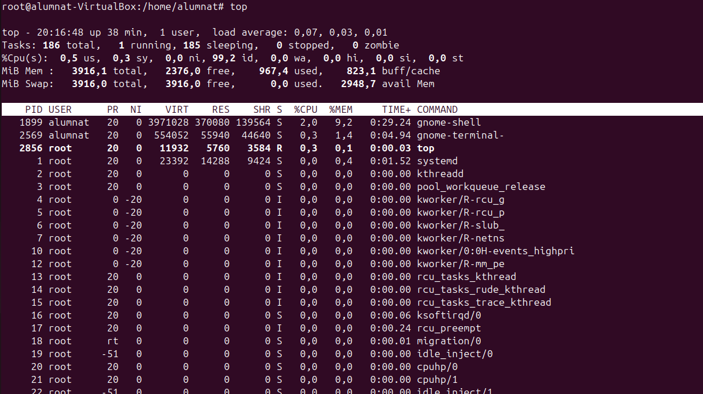

**Principals camps:**

    PID: Identificador del procés.
    USER: Usuari que executa el procés.
    %CPU: Percentatge d’ús de CPU.
    %MEM: Percentatge d’ús de memòria.
    TIME+: Temps total de CPU utilitzat pel procés.
    COMMAND: Nom de l’executable o comanda.

#### Comanda pstree

**``pstree`` mostra els processos en un format d’arbre jeràrquic, il·lustrant com estan relacionats els processos entre si (processos pares i fills).**

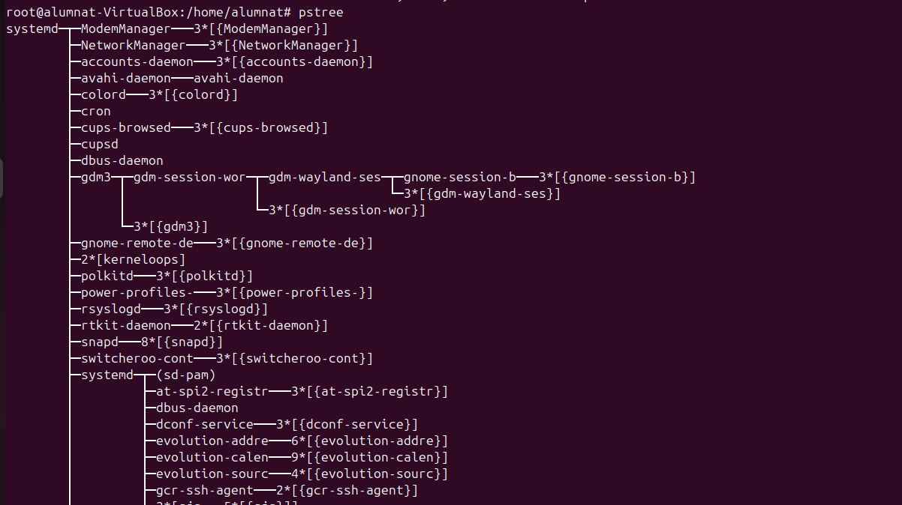

**Paràmetres útils:**

- -p: Mostra els PIDs al costat de cada procés.

``pstree -p``

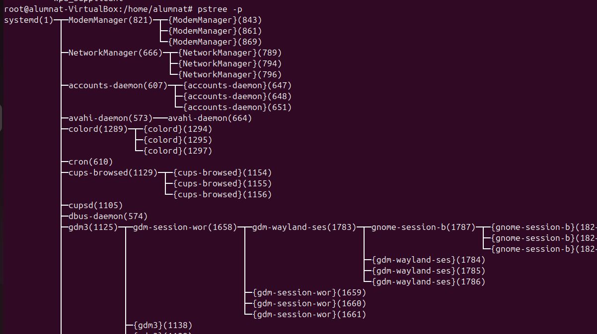

- -u: Mostra els noms dels usuaris associats als processos.

``pstree -u``

- -a: Mostra els arguments de les comandes dels processos.

``pstree -a``

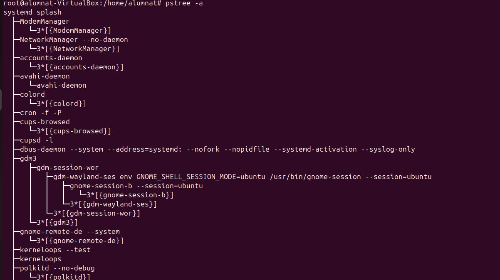

#### Comanda ps aux

Mostra una llista dels processos actius al sistema amb informació detallada.

``ps aux``

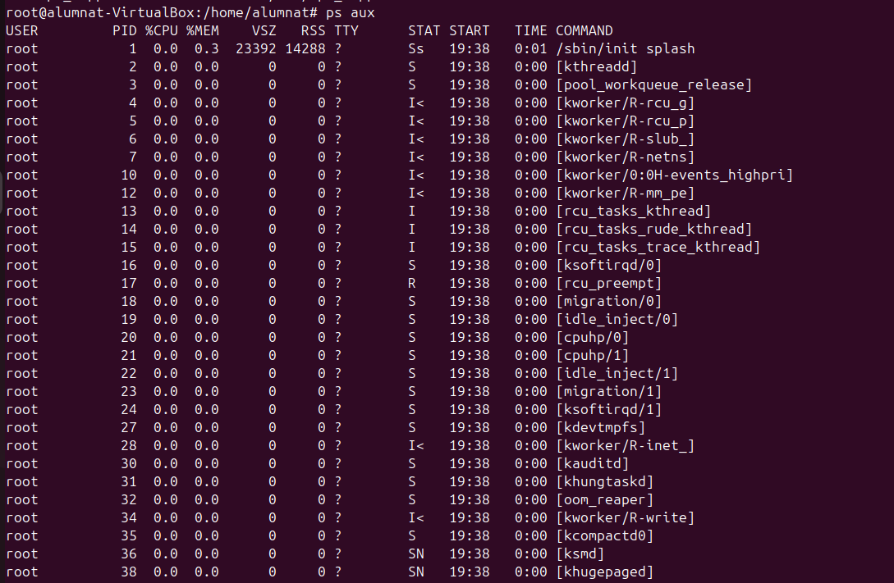

- a: Mostra tots els processos d'usuaris.
- u: Inclou informació detallada com usuari, consum de CPU i memòria.
- x: Mostra processos que no estan associats a cap terminal.

#### Ctrl+C

Ctrl + C s'utilitza per aturar un procés en execució a la terminal. 

Per exemple executant la comanda per fer ping a la nostra ip.

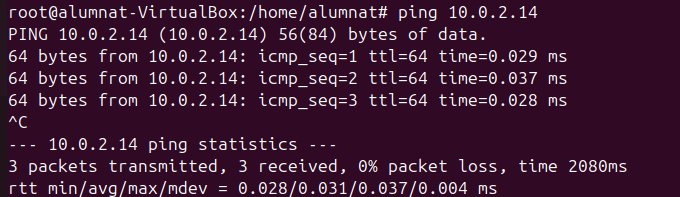

#### Ctrl+Z

Ctrl+Z s'utilitza per suspendre un procés en execució aturant-lo temporalment.

Utilitzem el mateix exemple:

#### Comanda jobs

Mostra la llista dels processos que s’executen en segon pla (background) o que estan suspesos a la sessió actual.

Resultat habitual:

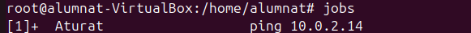

#### Comanda fg

Per reprendre un procés suspès o que s'executa en segon pla.

``fg %1``

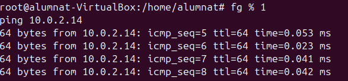

#### Comanda kill

S'utilitza per enviar senyals als processos per gestionar-los.

``kill -9 PID``

- -9: Envia el senyal SIGKILL, que força la terminació immediata del procés.

- PID: Identificador del procés a finalitzar (obtingut amb ps aux o top).

Si tens un procés amb PID 40 que vols matar:

``kill -9 40``

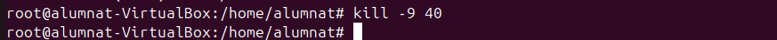

### Gestió d'usuaris i grups

- *PASSWD*

``etc/passwd``

És un fitxer de text on cada línia representa un usuari i les seves propietats. El format de cada línia és:

**usuari:x:UID:GID:comentari:/ruta/home:/shell**

- usuari: Nom de l'usuari.
- x: Indica que la contrasenya està encriptada a /etc/shadow.
- UID: Identificador únic de lusuari.
- GID: Identificador del grup principal de lusuari.
- comentari: Informació addicional de l'usuari.
- /ruta/home: Directori personal de lusuari.
- /shell: Shell predeterminat (com /bin/bash).

- *GROUP*

``/etc/group``

Aquest fitxer conté informació sobre els grups definits al sistema. Cada línia representa un grup amb el format:

**grup:x:GID:usuaris**

- grup: Nom del grup.
- x: Contrasenya del grup (normalment és a /etc/gshadow).
- GID: Identificador únic del grup.
- usuaris: Llista d'usuaris secundaris en aquest grup, separats per comes.

- *SHADOW*

``/etc/shadow``

Aquí s'emmagatzemen les contrasenyes encriptades dels usuaris i els detalls de caducitat de les contrasenyes. Només és accessible per l'usuari root. El format és:

**usuari:contrasenya-encriptada:últim-canvi:min-dies:max-dies:avís:inactiu:expiració:**

- contrasenya-encriptada: Contrasenya protegida.
- últim canvi: Dies des del darrer canvi de contrasenya.
- min-dies i max-dies: Temps mínim i màxim entre canvis.
- avís: Dies abans d'expirar la contrasenya que s'avisa a l'usuari.
- inactiu: Temps que el compte pot estar inactiu abans de desactivar-se.
- expiració: Data de caducitat del compte.

- *GSHADOW*

``/etc/gshadow``

Fitxer per gestionar contrasenyes de grups i configuracions avançades de permisos de grups. Similar a /etc/shadow, però per a grups. El format és:

**grup:contrasenya:administradors:membres**

- contrasenya: Contrasenya encriptada del grup.
- administradores: Usuaris amb permisos especials per gestionar el grup.
- membres: Usuaris secundaris del grup.

##### SKEL

``/etc/skel``

Aquest directori conté els fitxers i directoris predeterminats que es copien en crear un nou usuari. Tot el que estigui a /etc/skel es replicarà al directori personal de l'usuari recent creat.
**És essencial per garantir que cada usuari tingui configuracions inicials adequades.**

##### .profile

Propòsit: Configurar l'entorn d'usuari per a sessions d'inici no específiques de Bash, com quan utilitzes sh o quan inicies sessió al sistema (TTY o SSH).

##### .bash_logout

Propòsit: Configurar l'entorn de treball a shells interactius no d'inici de sessió. S'utilitza cada vegada que obris una nova terminal o intèrpret d'ordres interactiu.
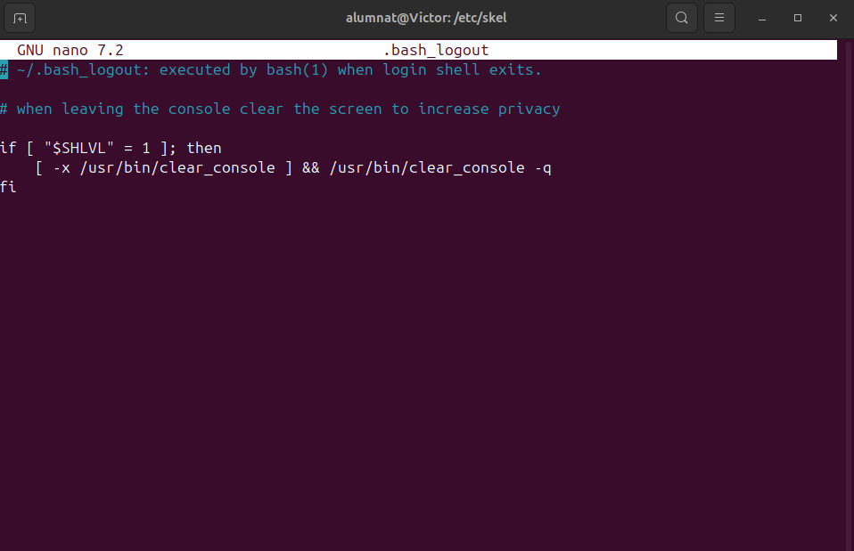

##### .bashrc

Propòsit: Configurar l'entorn de treball a shells interactius no d'inici de sessió. S'utilitza cada vegada que obris una nova terminal o intèrpret d'ordres interactiu.

### Afegir usuaris

Per afegir un usuari al sistema, es poden utilitzar dues comandes: **adduser i useradd**. La diferència principal és que adduser és una versió més amigable i interactiva de useradd, que generalment és més bàsica i directa.

##### **Comanda adduser** 

La comanda adduser és una versió més avançada i automàtica per crear usuaris. Aquesta comanda crea l'usuari, el seu directori personal i altres fitxers de configuració necessaris.
Exemple per crear un usuari anomenat josep:

``sudo adduser josep``

##### **Comanda useradd**

La comanda useradd és més simple i requereix més configuració manual. Aquesta comanda només crea l'usuari, però no crea un directori personal ni altres fitxers. 

``sudo useradd -m -s /bin/bash josep``
.png)

**L'opció -m crea el directori personal de l'usuari.** 

**L'opció -s especifica la shell (per exemple, /bin/bash).**

Comprovació quan es creen els usuaris

- Directori personal: /home/josep
- Grup d'usuari: el grup josep
- Arxius de configuració: .bashrc, .profile, etc.

### Eliminar usuaris

Per eliminar un usuari, es poden utilitzar les comandes deluser o userdel. 

##### **Comanda deluser**

Per eliminar un usuari amb deluser, utilitza: ``sudo deluser josep``

.png)

Aquesta comanda elimina l'usuari del sistema, però no elimina el seu directori personal. 
Si vols eliminar també el directori personal, utilitza: 

`` sudo deluser --remove-home josep ``

.png)

##### Comanda userdel
Per eliminar un usuari amb userdel: sudo userdel josep
Si vols eliminar també el directori personal, pots afegir l'opció -r: sudo userdel -r josep

Personalització de les comandes adduser i useradd
Personalització de useradd
La comanda useradd es pot personalitzar editant el fitxer de configuració /etc/default/useradd. Algunes de les opcions que es poden modificar inclouen:

- HOME: Configura el directori personal per defecte.
- SHELL: Configura la shell per defecte per als usuaris nous.
- GROUP: Configura si els usuaris seran creats amb un grup separat o assignats a un grup preexistent.

### Creació i configuració de grups

Crear un grup nou:

``sudo groupadd nom_grup ``

.png)

Afegir un usuari existent a un grup:

`` sudo usermod -aG nom_grup usuari_nom ``

Eliminar un grup:

``sudo groupdel nom_grup``

### Configuració de polítiques de contrasenyes

``sudo nano /etc/login.defs``

     PASS_MAX_DAYS: Màxim de dies per canviar la contrasenya.
     PASS_MIN_DAYS: Mínim de dies abans de poder canviar la contrasenya.
     PASS_MIN_LEN: Longitud mínima de la contrasenya.
     PASS_WARN_AGE: Dies d'advertència abans de la caducitat.

### Llistes de control d'accés
Les llistes de control d'accés (ACL) permeten especificar permisos addicionals per a usuaris o grups sobre fitxers i directoris

**Afegeix permisos d'escriptura a un usuari concret**

``setfacl -m u:usuari:w fitxer.txt``

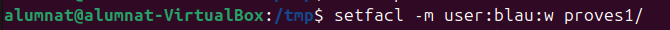

**Afegeix permisos de lectura a un grup**

``setfacl -m g:grup:r fitxer.txt``

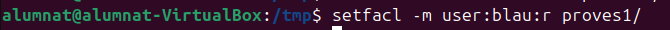

**Elimina permisos d'un usuari concret**

``setfacl -x u:usuari fitxer.txt``

**Visualitzar ACL existents**

``getfacl fitxer.txt``

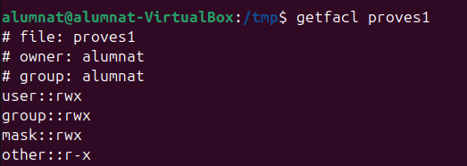

**Casos d'ús habituals**

- Donar accés addicional a usuaris sense canviar el propietari ni el grup del fitxer.
- Configurar permisos predeterminats per als nous fitxers dins d'un directori compartit.
- Gestionar accés granular en entorns multiusuari.

### Màscara de permisos umask
**La màscara de permisos umask utilitza tres dígits octals, cada un dels quals representa els permisos per a l'usuari, el grup i altres usuaris, respectivament. Els tres dígits són valors entre 0 i 7, que es poden desglossar així:**

- 0: Permís complet (lectura, escriptura i execució).
- 1: Permís només d'execució.
- 2: Permís només d'escriptura.
- 3: Permís d'escriptura i execució.
- 4: Permís només de lectura.
- 5: Permís de lectura i execució.
- 6: Permís de lectura i escriptura.
- 7: Sense permisos (el màxim bloqueig).

#### Per a què serveix umask
**La umask defineix quins permisos no es concediran de manera predeterminada quan es creen nous fitxers o directoris. Funciona invertint els bits dels permisos. Per exemple, si la umask està configurada a 022:**

- Permisos per defecte:

Fitxers: 666 (lectura i escriptura per a tots)
Directoris: 777 (lectura, escriptura i execució per a tots)

- Resultat aplicant la umask:

Amb umask 022, els permisos restants seran 644 per a fitxers (rw-r--r--) i 755 per a directoris (rwxr-xr-x).

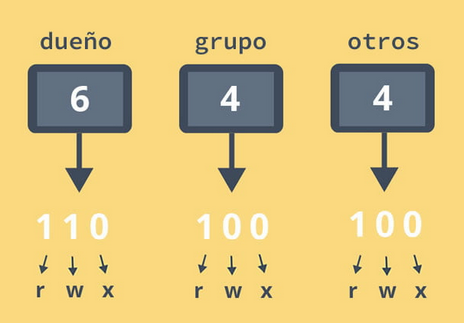

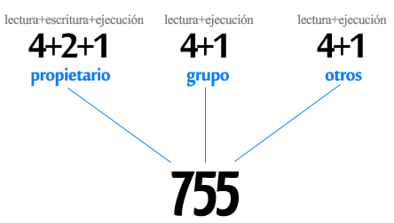

Modificar umask per a nous usuaris:

``/etc/login.defs``

#### Canvi temporal a un altre usuari

**Per canviar temporalment a un altre usuari en un terminal, es fa servir la comanda su.**

``su - nom_usuari`

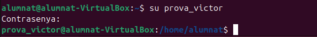

#### Canvi definitiu del umask

Perquè el canvi sigui permanent, cal editar els fitxers de configuració de l'usuari:

**Editar .bashrc**

umask 027

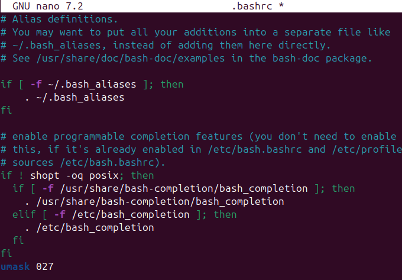
### Sistemes de fitxers i particions
``fdisk -l`` Informa sobre els discos que té sistema operatiu amb les seves dades.

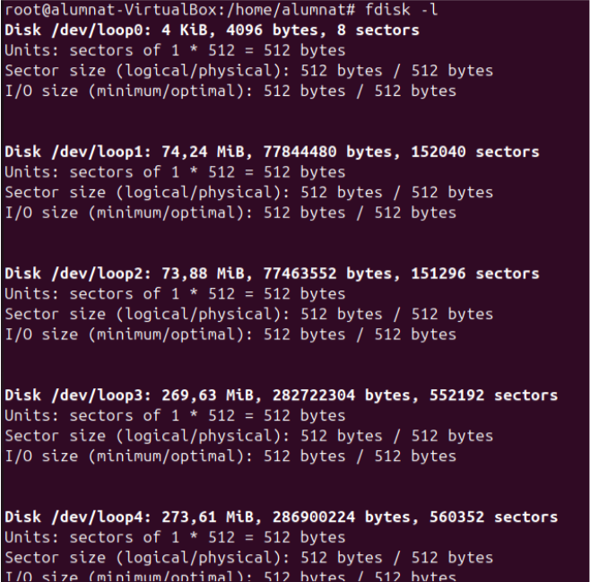

`tune2fs -l (partició)` Indica la mida del block que te la partició.

`df -T` Mostra l'ús del sistema d'arxius filtrat per un tipus específic de sistema de fitxers.

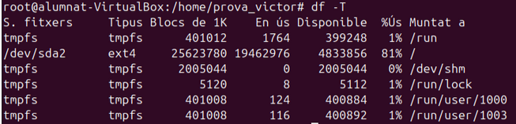

`du -b (arxiu)` Mostra la mida exacta del fitxer en bytes.

`du -sh (arxiu)` Mostra la mida del fitxer en un format KB.

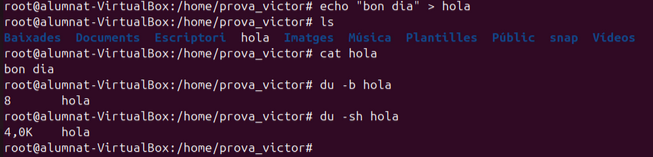

`e4defrag -c (partició)` Analitza el nivell de fragmentació de la partició en aquest cas /dev/sda2 i proporciona un informe. 

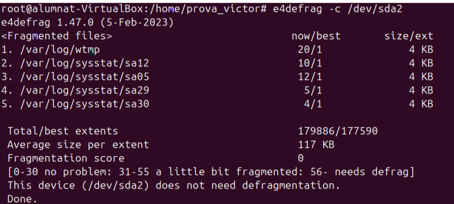

### Creació de particions i formateig

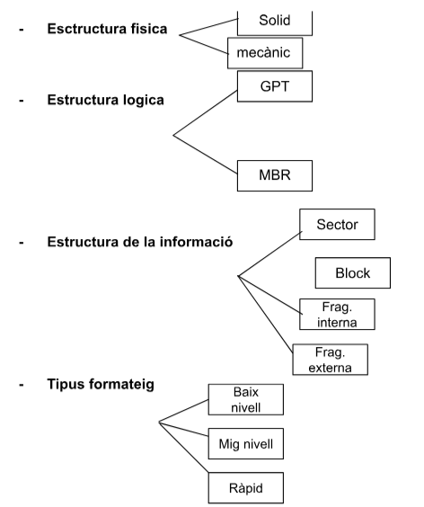

- **Estructura física:**

    Solid: Fa referència a dispositius d'estat sòlid (SSD), que no tenen parts mòbils i són més ràpids i resistents.

    Mecànic: Fa referència als discs durs tradicionals (HDD), que funcionen amb components mecànics com els plats giratoris i caps de lectura/escriptura.

- **Estructura lògica:**

    GPT (GUID Partition Table): Un sistema modern de particions que permet gestionar discs de gran capacitat (més de 2 TB) i que ofereix més seguretat i flexibilitat.

    MBR (Master Boot Record): Un sistema més antic de particions que suporta discs de fins a 2 TB i té certes limitacions respecte al nombre de particions.

- **Estructura de la informació:**

    Sector: La unitat bàsica d'emmagatzematge dins d'un dispositiu. Té una mida de 512 bytes o 4 KB.
    
    Block: Una agrupació de sectors que forma una unitat més gran per a facilitar la gestió de la informació.
        
    Fragmentació interna: Fa referència a la fragmentació que es produeix dins d'un bloc, quan no s'omple completament amb dades.
        
     Fragmentació externa: Fa referència a la fragmentació entre blocs, quan hi ha espais lliures dispersos en lloc de ser contigus.

- **Tipus de formatatge:**

    Baix nivell: Formatatge físic que prepara el disc per a emmagatzemar dades i crea sectors i pistes. 

    Mig nivell: Relacionat amb la creació de particions al disc. **No borra arxius els marca.**
    
    Ràpid: Formatatge que elimina només els registres d'accés a les dades, però no les esborra realment del disc. És més superficial i ràpid.

**1r part particions**

 - creació de particions formateig
 - muntatge
 - compartició carpeta servidor samba.

**creació de particions formateig**
 
Afegim un nou disc virtual de 2 GB per treballar.

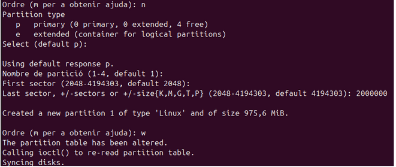

**Creació d'una nova partició**

   - Comanda utilitzada: n (new)

    Això inicia el procés per crear una nova partició.

   - Número de la partició: 1

    És la primera partició del disc.

- Sector inicial: 2048 (per defecte)

    L'usuari accepta el sector inicial per defecte, que és el primer disponible després del sector d'arrencada.

- Sector final: 2000000

    L'usuari especifica el sector final o la mida de la partició manualment, donant com a resultat una partició d'aproximadament 975,6 MiB.

- comanda: w

    L'usuari guarda els canvis a la taula de particions i surt de l'eina fdisk.

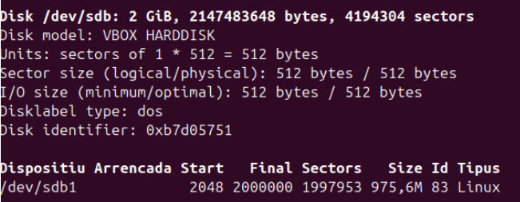

Explicació dels detalls:

    1./dev/sdb:
        
    És el dispositiu que es refereix al segon disc del sistema.

    2.Capacitat del disc:
        
    2 GiB: La mida total del disc és de 2 GiB.
    
    2147483648 bytes: Aquesta és la mida total del disc en bytes.
    4194304 sectors: El nombre total de sectors del disc.

    3.Mida dels sectors:
    512 bytes: Cada sector físic i lògic del disc té una mida de 512 bytes.

    4.Tipus de taula de particions:
        
    dos: Indica que aquest disc utilitza el tipus de taula de particions MBR (Master Boot Record),(com un màxim de 2 TB per partició).

    5.Identificador del disc:
        
    0xb7d05751: Un identificador únic assignat al disc.

#### Formatejar

Formatem la partició i modifiquem la mida del bloc.

`mkfs.ext4 -b (modificació de la mida) (disc)`

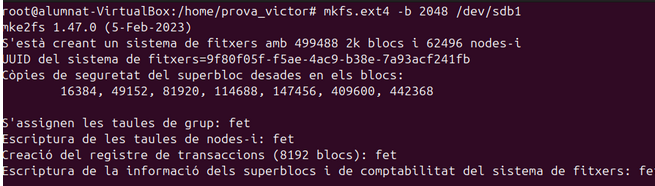

`tune2fs -l /dev/sbd1 | grep Block` Amb aquesta comanda comprovem el formateig. 

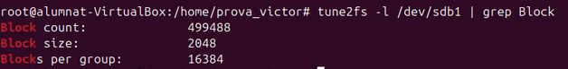

#### Muntatge

Abans de tot creem una carpeta a /var/ i dins li posem un fitxer en aquest cas anomenat "hola".

Dintre del punt de muntatge farem `mount -t ext4 /dev/sbd1 /var/particio1` i un cop muntada la partició apareixerà.

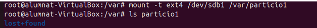

El fitxer hola no com es veu no apareix però amb la següent comanda podem comprovar que no s'aperdut.

`umount /dev/sdb`
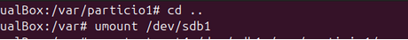

Creem un nou fitxer a l'interior amb la partició creada.

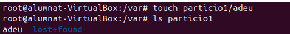

(Aquesta partició es temporal es a dir que quan apagem l'ordinador s'eliminarà.)
### Definitiva

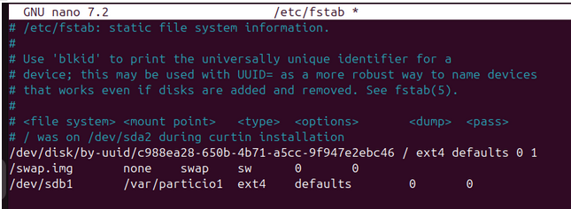

`/etc/fstab/` S'utilitza en sistemes Linux per definir quines particions i sistemes de fitxers es munten automàticament en arrencar el sistema.

Fem un reboot per comprovar que segueix la partició.

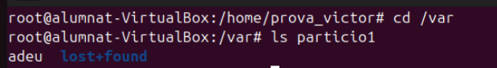

#### Compartició carpeta servidor samba.

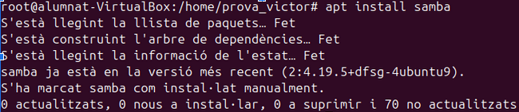

excutem `apt install samba`

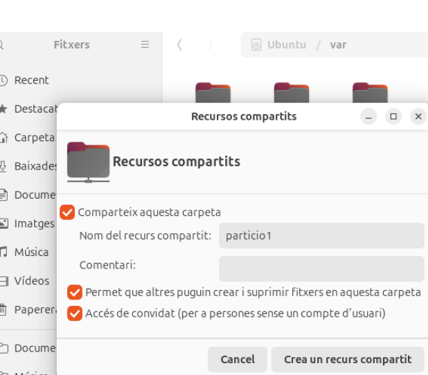

Compartim la carpeta amb el seu nom.

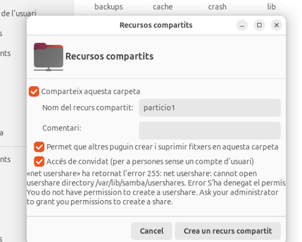

Però ens salta un error al crear la compartició.

Llavors anem a `/etc/samba/smb.conf` i creem la partició.

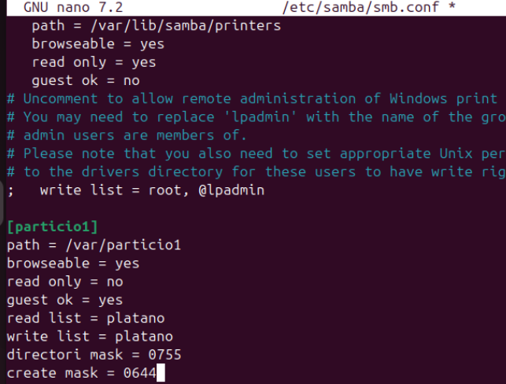

I reiciem  amb un `systemctl restart` a smbd i nmbd

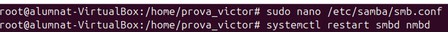

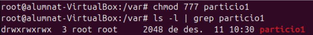

Canviem els permisos perquè tots tinguin permisos sobre la carpeta particio1 i li canviem el grup

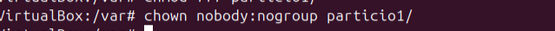

També l'ususari propietari a nobody i nogroup.

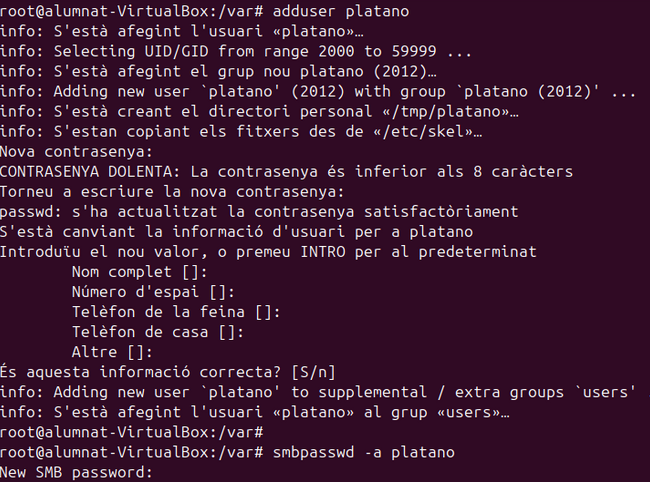

Ara bé creem l'usuari "platano" amb la comanda `adduser`

(Important ens demana contrasenya del smb)

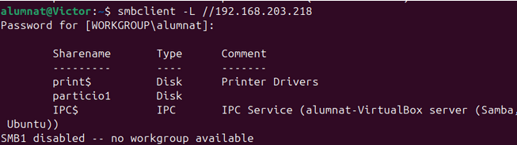

Montem la ruta amb la nostra ip. Això a la maquina real.

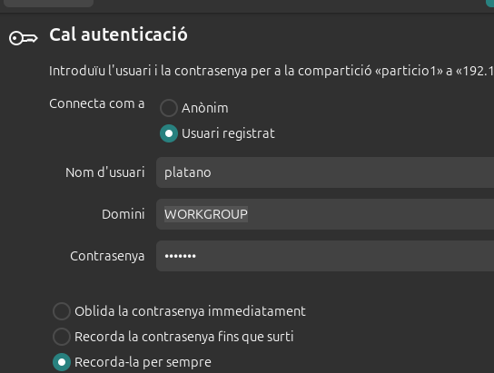

A la autenticació només es posar l'usuari, domini i contrasenya que hem assignat. I un com fet això comprovem els resultats.

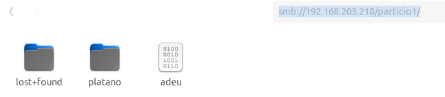

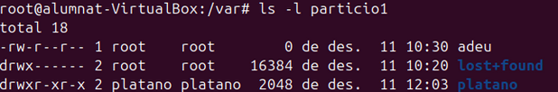

### Quotes de disc

El disc com es pot veure es el /dev/sdb de 2 GiB.
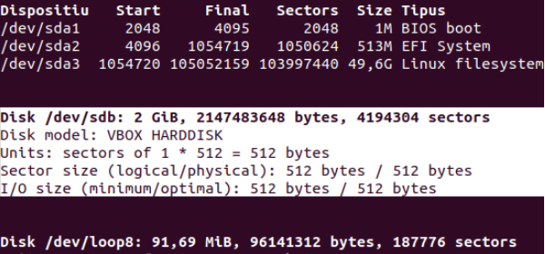

I creem una partició primaria sobre el disc.

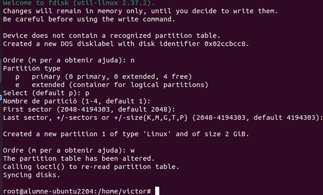

`mkfs.ext4 /dev/sdb1` mostra el procés de creació d'un sistema de fitxers de tipus ext4 a la partició /dev/sdb1 utilitzant la comanda mkfs.ext4.

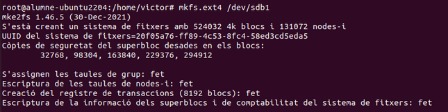

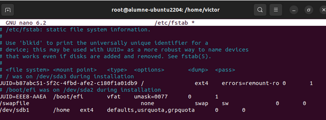

`/etc/fstab` muntem automàticament el disc /dev/sdb1 per a que quan el sistema arrenca.